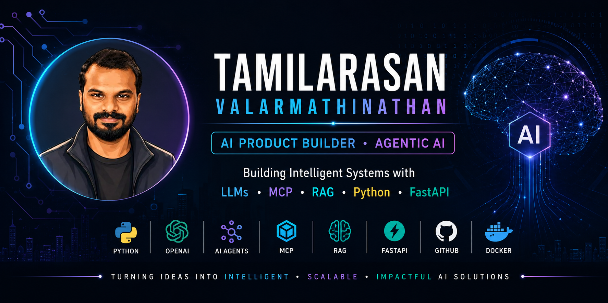

# Hi there 👋,

I'm Tamilarasan Valarmathinathan

I build intelligent AI applications that solve real-world problems by combining **Product Thinking**, **Large Language Models (LLMs)**, **Agentic AI**, and **Automation**.

With 12+ years of experience across Product Management, Agile Delivery, Business Analysis, and Software Engineering, I'm currently focused on designing and building next-generation AI systems using modern AI frameworks.

---

## 🧠 What I'm Working On

- 🤖 Multi-Agent AI Systems
- 🔗 MCP (Model Context Protocol)
- 🧠 Retrieval-Augmented Generation (RAG)
- ⚡ AI Workflow Automation
- 💬 Conversational AI
- 📊 AI Product Strategy
- 🔍 Prompt Engineering
- 📈 AI-powered Business Solutions

---

## 💻 Tech Stack

### Languages
- Python
- SQL
- JavaScript

### AI & ML
- OpenAI API
- Azure AI Foundry
- Google ADK
- LangChain
- LangGraph
- MCP
- RAG
- Vector Databases
- Prompt Engineering

### Backend
- FastAPI
- REST APIs
- SQLite
- PostgreSQL

### Cloud & DevOps
- GitHub
- GitHub Actions
- Azure DevOps

### Product & Agile
- Scrum
- SAFe
- Jira
- Confluence
- Product Discovery
- Product Strategy

---

## 🌱 Currently Learning

- Advanced AI Agents
- Multi-Agent Orchestration
- MCP Servers
- Agent Memory
- AI Evaluation
- LLM
- Model Context Protocol
- Production-ready AI Systems

---

## 📂 Featured Projects

### 🤖 AI Interview Coach
Interactive AI Interview Preparation Platform powered by LLMs.

### 🧠 Personal AI Assistant
An AI assistant with memory, tools, and reasoning capabilities.

### 🔗 MCP Playground
Experiments with Model Context Protocol servers and AI tools.

### 📊 AI Product Toolkit
Resources, templates, and frameworks for AI Product Managers.

### ⚡ Automation Agents
AI agents that automate repetitive business workflows.

---

## 🎯 2026 Goals

- Build 15+ AI Projects
- Contribute to Open Source
- Master AI Agents & MCP
- Build Production-grade AI Applications
- Share knowledge with the developer community

---

## 📈 GitHub Stats

---

## 🤝 Let's Connect

- 💼 LinkedIn: https://linkedin.com/in/tamilarasanpkv06
- 🌐 Portfolio: Coming Soon
- 📧 Email: tamilarasanpkv@outlook.com

---

> **"Building AI that doesn't just answer questions—it solves problems."** 🚀
